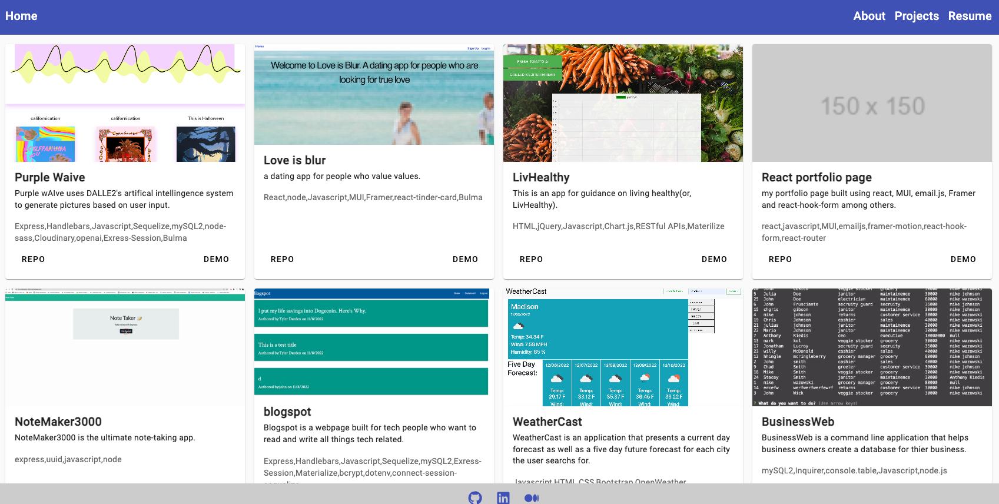

# TypeScript-Angular-Portfolio


## Description

Welcome to my portfolio repository.... Click on the link below to check out my portfolio page on Github pages! It is built using Angular,TypeScript and Angular Material among others. The purpose of this project to practive Typescript and Angular.

[link to my porfolio on Github pages](https://chrischarlesgibson.github.io/TypeScript-Angular-Portfolio/)



## Table of Contents

- [Description](#Description)
- [Installation](#Installation)
- [Usage](#Usage)
- [Built-With](#Built-With)
- [Author](#Author)
- [Badges](#Badges)
- [License](#License)

## Installation

Here are the dependencies and scripts needed to run this app locally:

```
  "scripts": {
    "ng": "ng",
    "start": "ng serve",
    "build": "ng build",
    "watch": "ng build --watch --configuration development",
    "test": "ng test",
    "predeploy": "npm run build",
    "deploy": "gh-pages -d build"
  },
  "private": true,
  "dependencies": {
    "@angular/animations": "^15.2.0",
    "@angular/cdk": "^15.2.5",
    "@angular/common": "^15.2.0",
    "@angular/compiler": "^15.2.0",
    "@angular/core": "^15.2.0",
    "@angular/flex-layout": "^15.0.0-beta.42",
    "@angular/forms": "^15.2.0",
    "@angular/material": "^15.2.5",
    "@angular/platform-browser": "^15.2.0",
    "@angular/platform-browser-dynamic": "^15.2.0",
    "@angular/router": "^15.2.0",
    "@fortawesome/angular-fontawesome": "^0.12.1",
    "@fortawesome/fontawesome-svg-core": "^6.4.0",
    "@fortawesome/free-brands-svg-icons": "^6.4.0",
    "@fortawesome/free-regular-svg-icons": "^6.2.1",
    "@fortawesome/free-solid-svg-icons": "^6.4.0",
    "@fortawesome/react-fontawesome": "^0.2.0",
    "gh-pages": "^5.0.0",
    "rxjs": "~7.8.0",
    "tslib": "^2.3.0",
    "zone.js": "~0.12.0"
  },
  "devDependencies": {
    "@angular-devkit/build-angular": "^15.2.4",
    "@angular/cli": "~15.2.4",
    "@angular/compiler-cli": "^15.2.0",
    "@types/jasmine": "~4.3.0",
    "jasmine-core": "~4.5.0",
    "karma": "~6.4.0",
    "karma-chrome-launcher": "~3.1.0",
    "karma-coverage": "~2.2.0",
    "karma-jasmine": "~5.1.0",
    "karma-jasmine-html-reporter": "~2.0.0",
    "typescript": "~4.9.4"
  }


```

## Usage

Just click on the github pages link to open the app or if you want to use this app locally, first go to the to root directory, and open an integrated terminal and run "npm install" and then "ng serve". Make sure you have the Anguklar CLI installed to make the "ng serve: command. This will build and open up the react app.

## Built With

- 
- 
- 
- 
- 

## Author

**Chris Gibson**

- [Link to Chris's LinkedIn](https://www.linkedin.com/in/chris-gibson-415909250/)

## Badges


## License

Licensed under the MIT license.[License details here](https://opensource.org/licenses/MIT)
